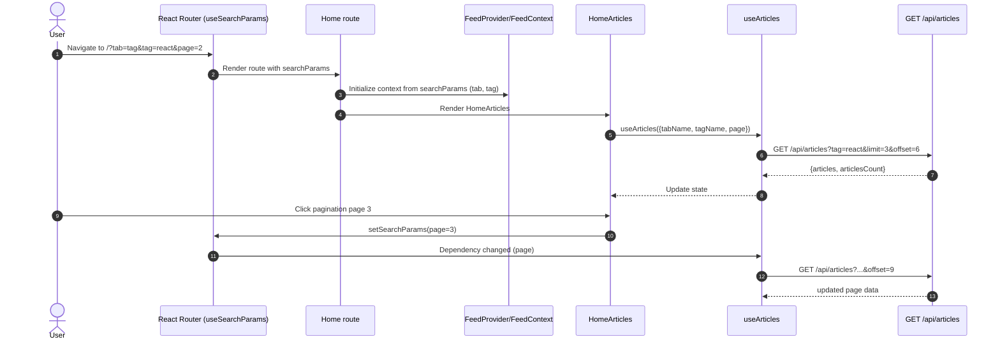

# Architecture — EPMCDMETST-58154

Jira: https://jiraeu.epam.com/browse/EPMCDMETST-58154  
Epic: https://jiraeu.epam.com/browse/EPMCDMETST-58066

## Goal
Enable **deep-linkable Home feed state** by syncing the selected feed **tab**, **tag**, and **page** with URL query params.

- Current state is held in React context only; refresh/back/forward do not restore state.
- Backend already supports filtering/pagination via query params to `/api/articles`.

## In-scope
- Frontend only: React Router query params (`useSearchParams`) become the source of truth for Home feed state.
- FeedContext refactor: stop relying on `e.target.innerText`.
- Pagination becomes URL-driven (`page` param) and controlled via `forcePage`.
- Unit tests (Vitest) + (optional) e2e tests if Playwright already exists in repo.

## Out of scope
- Backend changes.
- Changing API contract for `/api/articles`.

## Architecture overview

### Components involved (existing)
- `frontend/src/routes/Home.jsx` — wraps feed UI with `FeedProvider`.
- `frontend/src/context/FeedContext.jsx` — holds `{ tabName, tagName }` and exposes `changeTab`.
- `frontend/src/routes/HomeArticles.jsx` — reads feed context and uses `useArticles`.
- `frontend/src/hooks/useArticles.js` — fetches articles via `getArticles`.
- `frontend/src/components/ArticlesPagination/ArticlesPagination.jsx` — paginates via `getArticles`.

### Proposed state model (URL as source of truth)
Query params on `/` define the Home feed selection:
- `tab`: `global | feed | tag`
- `tag`: required when `tab=tag`
- `page`: zero-based page index (integer >= 0)

When the user changes tab/tag/page, we update query params; listeners derive state and trigger fetch.

## Data flow (sequence)

## Integration points
- **Router**: Home page uses `useSearchParams`.
- **Context**: FeedContext exposes explicit setters (e.g., `setFeed({tabName, tagName})`) rather than using DOM text.
- **Pagination**: reads current `page` from URL and updates it on click.
- **Auth**: if `tab=feed` but user is not authenticated, fallback to `tab=global`.

## Error handling / fallbacks
- Unknown `tab` ⇒ default (`feed` if authenticated else `global`).
- `tab=tag` without `tag` ⇒ fallback to default tab.
- Non-numeric/negative `page` ⇒ treat as `0`.

## Key design decisions / assumptions
- **Page index stored in URL is zero-based** to match `react-paginate`’s `selected` value. (If product prefers 1-based URLs, conversion is possible; document and test whichever is chosen.)
- Article page size remains **3** (as currently implied by `ArticlesPagination` dividing by 3 and `getArticles` default limit).

## Security & privacy
No new sensitive data in URL. Tags and page index are non-sensitive.
