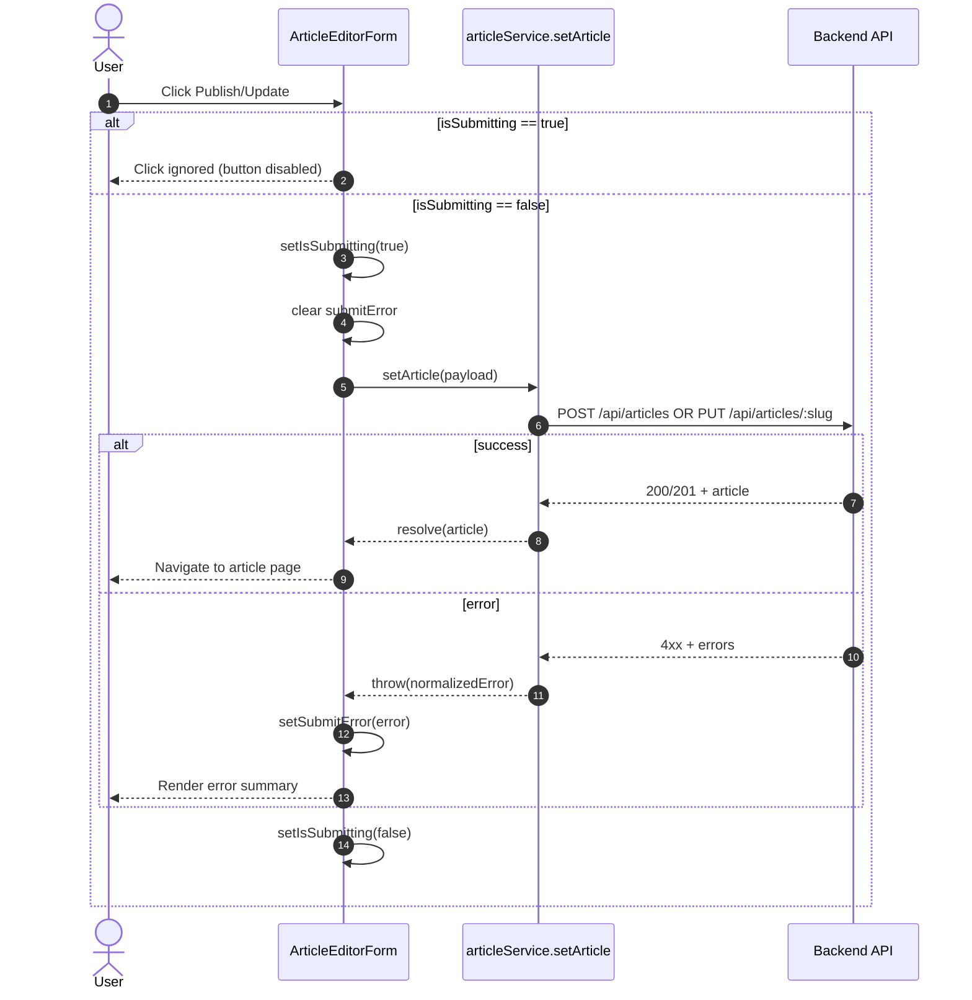

# Architecture — EPMCDMETST-58171

Jira: **EPMCDMETST-58171**  
Epic: **EPMCDMETST-58170**

## Goal
Improve the Article Editor submit experience by:
- preventing duplicate submissions (disable button while request is in-flight)
- providing clear, resilient error summary rendering on failure

## Scope
- **Frontend only** (React)
- No API contract changes
- No backend changes

## Existing components/services (as-is)
- `frontend/src/components/ArticleEditorForm/ArticleEditorForm.jsx`
- `frontend/src/services/articleService.js` (contains `setArticle`)
- `frontend/src/helpers/errorHandler.js` (normalizes API errors; may currently reduce errors to a single string)

## Proposed architecture changes
- Add local UI state to Article Editor form:
  - `isSubmitting: boolean`
  - `submitError: string | string[] | Record<string, string[]> | null`
- Wrap `setArticle(...)` call to:
  - set `isSubmitting=true` at start
  - clear previous `submitError`
  - on success: navigate as it does today
  - on error: capture and display error summary
  - finally: set `isSubmitting=false`

### Component-level flow

## Assumptions / open points (documented for review)
- The backend already returns validation errors in a structure like `{ errors: { field: [msg] } }` per RealWorld spec.
- Current `errorHandler` may flatten errors. We will **not** change backend behavior; any improvement to client-side error presentation should tolerate both flattened and structured errors.

## Non-functional considerations
- Accessibility: error summary should be visible and ideally placed near the top of the form.
- Usability: disabling submit button prevents accidental duplicate posts.
