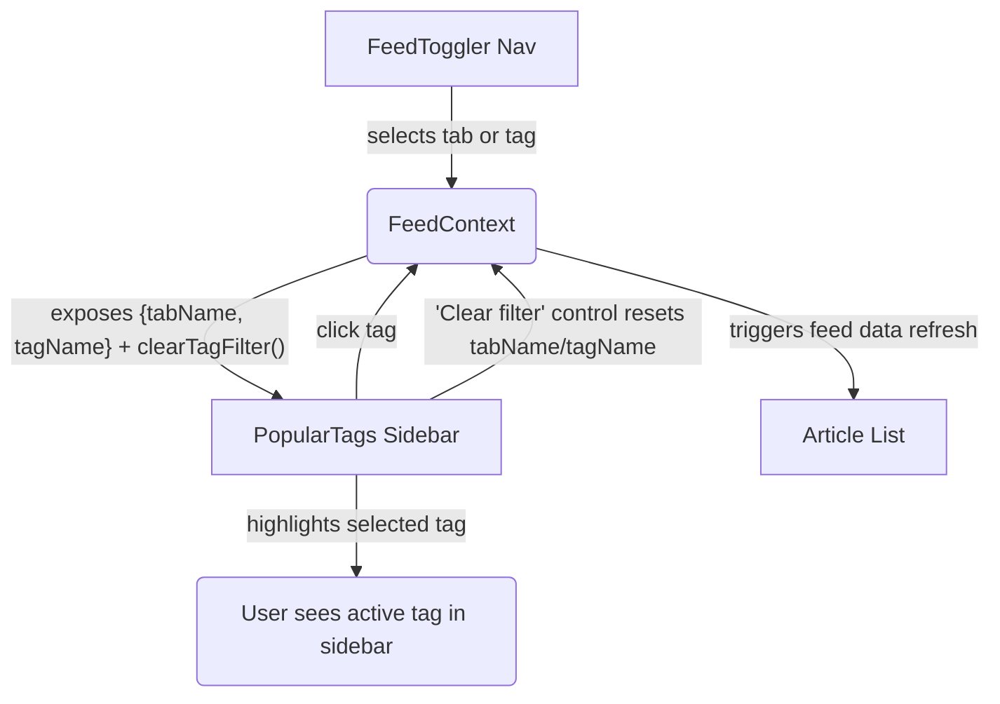

# Architecture: Popular Tags Selected-State + Clear Filter (EPMCDMETST-58305)

[Jira Story: EPMCDMETST-58305](https://jiraeu.epam.com/browse/EPMCDMETST-58305)

## Context
Conduit RealWorld example app (frontend/src): the homepage 'Popular Tags' sidebar allows filtering the article list by tag, but does not highlight which tag is active, nor provide a way to clear the filter from the same UI.

## Functional Placement
- Main logic: frontend/src/components/PopularTags/TagButton.jsx (+ modification in FeedContext)
- State: frontend/src/context/FeedContext.jsx ({ tabName, tagName })

## High-level Flow

## Sequence
1. User clicks a tag pill in the sidebar → FeedContext updates tabName='tag', tagName=selected tag.
2. Sidebar highlights selected tag pill.
3. 'Clear filter' appears; clicking it sets tabName to default ("feed"/"global" per auth), tagName=''.
4. Feed refreshes with latest articles accordingly.

## No Backend Impact
All state transitions and UI are handled client-side. Existing GET /api/articles?tag=... remains.

---
