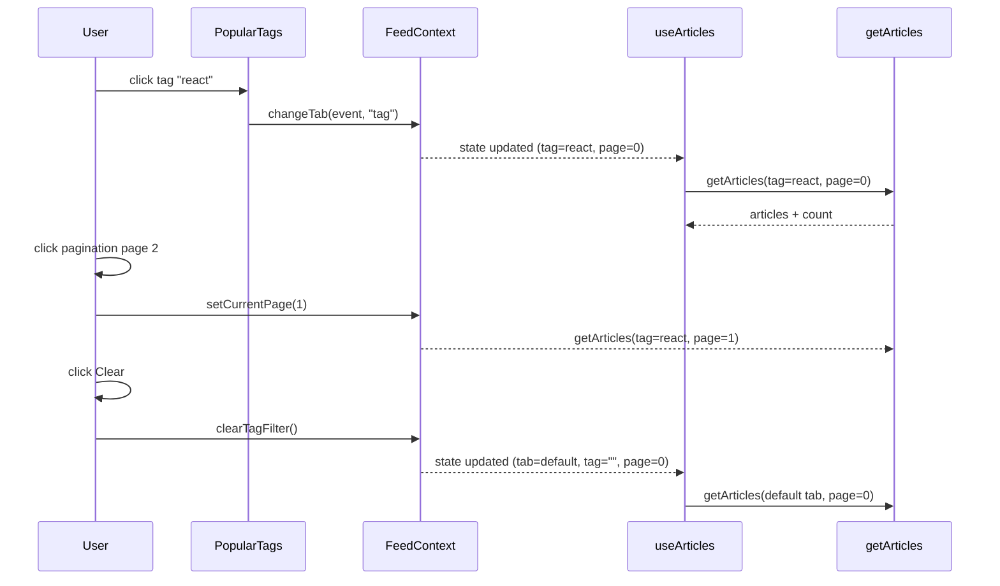

# Low-level design (LLD) — EPMCDMETST-58457

Jira: [EPMCDMETST-58457](https://jiraeu.epam.com/browse/EPMCDMETST-58457)

## Files in scope
- `frontend/src/context/FeedContext.jsx`
- `frontend/src/routes/HomeArticles.jsx`
- `frontend/src/components/ArticlesPagination/ArticlesPagination.jsx`
- `frontend/src/components/FeedToggler/FeedToggler.jsx`

## Detailed design

### 1) FeedContext changes
Current state:
```js
const [{ tabName, tagName }, setTab] = useState({ tabName: ..., tagName: "" });
```

Proposed state shape:
```ts
type FeedState = {
  tabName: "feed" | "global" | "tag";
  tagName: string;
  currentPage: number; // 0-based
};
```

Initialization:
- `tabName`: `isAuth ? 'feed' : 'global'`
- `tagName`: `""`
- `currentPage`: `0`

Behavior:
- `useEffect([isAuth])`: when auth changes, set default tab and keep tag cleared; also reset page.
- `changeTab(e, tabName)`:
  - derive `tagName` only when switching to tag mode
  - set `{tabName, tagName, currentPage: 0}`
- `clearTagFilter()`:
  - if `tabName !== 'tag'` do nothing
  - set to `{tabName: defaultTab, tagName: "", currentPage: 0}`
- `setCurrentPage(page)`:
  - update state: `currentPage: page`

Provider value:
```js
<FeedContext.Provider value={{
  tabName,
  tagName,
  currentPage,
  changeTab,
  clearTagFilter,
  setCurrentPage,
}}>
```

### 2) HomeArticles wiring
Update `HomeArticles` to consume `currentPage` and pass it into pagination.

Proposed props for `ArticlesPagination`:
```ts
type Props = {
  articlesCount: number;
  location: string;
  tagName?: string;
  username?: string;
  currentPage: number;
  onPageChange: (page: number) => void;
  updateArticles: (data) => void;
};
```

### 3) ArticlesPagination component (controlled)
Change `handlePageChange` to:
- read `selected` (0-based)
- call `onPageChange(selected)`
- call `getArticles({ page: selected, ... })` then `updateArticles`

Add:
- `forcePage={currentPage}`

Edge cases:
- if `articlesCount` changes such that `currentPage >= totalPages`, parent state should already reset to 0 on tab/tag changes; for safety, pagination can clamp by forcing 0 when `totalPages === 0`.

### 4) FeedToggler clear control
When `tabName === 'tag'`:
- Render tag pill (existing)
- Add a small adjacent button/link:
  - label: `Clear`
  - `type="button"`
  - `className`: keep consistent with Conduit styling (e.g., `btn btn-sm btn-outline-secondary` or a simple `nav-link`-styled button)
  - `onClick={clearTagFilter}`
  - `aria-label="Clear tag filter"`

## Sequence diagram


## Open questions / assumptions
- **Assumption:** page size is fixed at 3 (currently used by pagination totalPages calculation). This story does not change it.
- **Assumption:** `react-paginate` uses 0-based `selected`, matching current service call.
