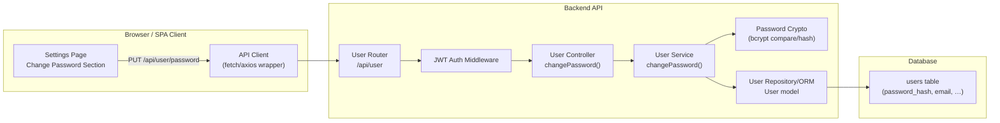

# EPMCDMETST-55333 — Architecture Document (Change Password)

## Overview
This enhancement adds a secure **Change Password** flow for authenticated users.

- **Frontend**: Settings page gets a new “Change Password” section with current/new/confirm fields and a Save action.
- **Backend**: Adds a **JWT-protected** endpoint `PUT /api/user/password` that verifies the current password and updates the stored password hash.

This design follows existing RealWorld/Conduit patterns: REST JSON API, JWT auth middleware, and password hashing with the same crypto strategy used in register/login.

## Goals
- Allow authenticated users to change their password from Settings.
- Require the **current password** to prevent unauthorized changes.
- Enforce basic validation and deliver user-friendly errors.

## Non-goals
- Token/session invalidation or forced re-login (JWT is typically stateless in this codebase).
- Password strength rules beyond basic minimums unless already present.

## System context
### Key flows
1. User opens **Settings** page.
2. User enters current password, new password, and confirmation.
3. Frontend validates and sends `PUT /api/user/password` with JWT.
4. Backend authenticates JWT, verifies current password, hashes new password, persists user.
5. UI clears fields and shows success, or displays errors.

## Component diagram


## Technology & conventions
- **Auth**: Reuse existing JWT middleware (`auth.required` or equivalent).
- **Crypto**: Reuse existing password hashing/verification functions (e.g., bcrypt).
- **Persistence**: Update existing user record’s password hash using existing ORM/model conventions.
- **API payload**: Use wrapped RealWorld style request/response objects.

## Security considerations
- Endpoint requires a valid JWT.
- Verify `currentPassword` using bcrypt compare (or existing helper).
- Hash `newPassword` with the same strategy (salt rounds/cost) as registration.
- Do not return password hashes.
- Return a **422** error for “current password incorrect” with a field-level error payload:
  ```json
  { "errors": { "currentPassword": ["is incorrect"] } }
  ```

## Observability
- Log only high-level events (success/failure) without including passwords.
- Surface backend validation errors to UI in a consistent field-error format.
