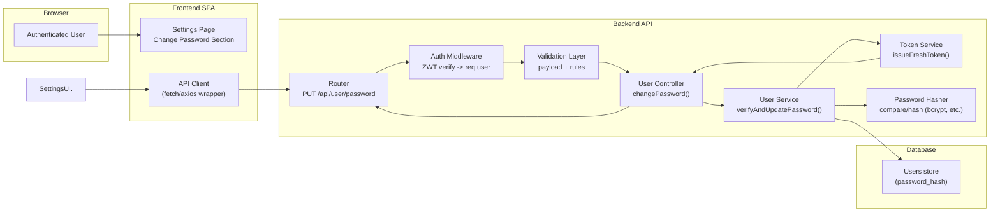

# EPMCDMETST-55333 — Architecture Document – Change Password

## Overview
This enhancement adds authenticated password change capability in the existing Conduit (RealWorld) application.

**User goal:** An authenticated user can change their password in **Settings**.
**Backend capability:** New endpoint `PUT /api/user/password` that:
- Requires JWT authentication
- Verifies `currentPassword`
- Validates `confirmPassword`
- Updates the stored password hash
- Returns the **full user object with a fresh token**, same response shape as `PUT /api/user`

## Context in existing system
The Conduit application already includes:
- SPA frontend with a Settings page used for user profile updates
- Backend API following RealWorld patterns (`/api/user`, `/api/users/login`, etc.)
- JWT auth middleware
- User persistence with hashed passwords and login verification

This story extends the existing “user/account” slice with a dedicated password-change endpoint and a corresponding Settings UI section.

## Key architectural decisions
1. **Dedicated endpoint (`PUT /api/user/password`)**
   - Keeps password change concerns separate from the existing profile update endpoint.
   - Allows stricter validation and targeted error reporting without impacting profile updates.

2. **Reuse existing auth + hashing**
   - JWT verification uses existing auth middleware.
   - Password hashing and comparison reuses the same mechanisms as login/registration.

3. **Fresh token on success**
   - On successful password update, the API returns the same user response shape as `PUT /api/user`, including a **newly issued JWT** (fresh token).

4. **Validation strategy**
   - Client-side validation for usability.
   - Server-side validation for correctness/security, including `confirmPassword`.

5. **No schema changes**
   - Password change updates the existing password hash field in the `users` table/collection.

## Component diagram (Mermaid)

## Technology choices and constraints
- **Authentication:** JWT Bearer token in `Authorization` header (RealWorld convention: `Token <jwt>`).
- **Password hashing:** reuse existing hashing library already used by login/registration (typically bcrypt/bcryptjs or framework equivalent).
m, **Validation:** reuse existing request validation patterns in the backend (middleware or controller-level checks).
- **Response contract:** same shape as the existing `PUT /api/user` response (includes `oken`).
- **Security considerations:**
  - Never log passwords.
  - Return field-based validation errors in standard RealWorld `{ errors: { field: [messages] } }` format.
  - Use generic “incorrect current password” error without revealing details.
  - Token rotation: always issue a fresh token after password change.

## Non-goals
- Password reset via email (forgot password)
- MFA
- Session invalidation across devices (unless already supported by token revocation)
- Additional password complexity beyond existing registration policy
